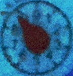

# PHP Analog Meter Reader

Reads analog meters with PHP.

| 0 | 1 | 2 | 3 | 4 | 5 | 6 | 7 | 8 | 9 |
|---|---|---|---|---|---|---|---|---|---|
|  |  | | | | | | | | 

 [](//packagist.org/packages/nohn/analogmeterreader) [](//packagist.org/packages/nohn/analogmeterreader) [](//packagist.org/packages/nohn/analogmeterreader) [](//packagist.org/packages/nohn/analogmeterreader)

## Installation

    $ composer require nohn/analogmeterreader

## Usage

### Passing an Imagick object

```php
use nohn\AnalogMeterReader\AnalogMeter;

$amr = new AnalogMeter($imagick_object, 'r');
echo $amr->getValue();
```

### Passing a file path

```php
use nohn\AnalogMeterReader\AnalogMeter;

$amr = new AnalogMeter($path_to_image_file, 'r');
echo $amr->getValue();
```

### Practical use example

See [nohn/watermeter](https://github.com/nohn/watermeter) for a real world use case.

## How to contribute

You can contribute to this project by:

* Opening an [Issue](https://github.com/nohn/analogmeterreader/issues) if you found a bug or wish to propose a new feature
* Placing a [Pull Request](https://github.com/nohn/analogmeterreader/pulls) with [test Images](tests/resources/images/), bugfixes, new features etc.

## License

analogmeterreader is released under the [GNU Affero General Public License](LICENSE).